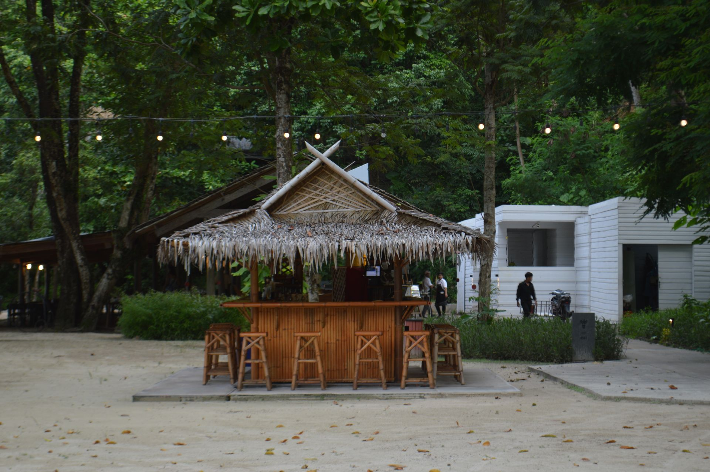

# La Paillote de Massane — Site web

Site vitrine complet en HTML / CSS / JS pur (aucun framework, aucune étape de build).

## Structure du projet

```
/
├── index.html          Accueil
├── carte.html           La Carte (petit-déjeuner / plats / bar)
├── evenements.html       Événements
├── galerie.html          Galerie photo + lightbox
├── contact.html          Contact + formulaire de réservation
├── robots.txt
├── sitemap.xml
├── css/
│   └── style.css        Feuille de style unique (design system, animations, responsive)
├── js/
│   └── script.js         Navigation, scroll reveal, parallax, galerie, formulaire
└── images/                Photos (voir ci-dessous) + logo-mark.svg / favicon.svg
```

## 📸 À propos des images

Je n'ai pas pu générer une photo "IA réaliste" à partir de votre photo d'origine (aucun outil
de génération/retouche d'image n'était disponible dans cet environnement, et le fichier de la
photo envoyée dans la conversation n'était pas accessible sur le disque).

À la place, le site utilise de **vraies photographies libres de droits** (licence Pexels :
usage commercial autorisé, sans attribution obligatoire), sélectionnées et téléchargées une par
une pour coller à l'ambiance de votre photo — paillote en bois, toit de chaume, guirlandes
lumineuses, terrasse, cuisine méditerranéenne, collines façon garrigue. Elles sont stockées en
local dans `images/*.jpg`, aucune dépendance à un service externe.

**Pour remplacer une photo par la vôtre**, gardez le même nom de fichier (ou changez le `src`
dans le HTML) :

```html

```

Fichiers à remplacer en priorité par vos propres photos si vous en avez :
- `images/hero-paillote.jpg` → photo principale du hero (recommandé : 1600px de large minimum, format paysage)
- `images/about-paillote.jpg` → photo pour la section "À propos" (format portrait)
- `images/carte-petit-dej.jpg`, `images/carte-plats.jpg`, `images/carte-bar.jpg` → les 3 photos de la page "La Carte"
- `images/gallery-*.jpg` → les 9 photos de la galerie

Pensez à compresser vos photos (TinyPNG, Squoosh.app) avant de les mettre en ligne pour garder
un site rapide. `images/logo-mark.svg` et `images/favicon.svg` sont des icônes vectorielles de
marque (logo, onglet navigateur) : elles n'ont pas besoin d'être remplacées par des photos.

Fichiers à remplacer en priorité :
- `images/hero-paillote.svg` → photo principale du hero (recommandé : 1600×1000px minimum, format paysage)
- `images/about-paillote.svg` → photo verticale pour la section "À propos" (format 4:5)
- `images/carte-petit-dej.svg`, `images/carte-plats.svg`, `images/carte-bar.svg` → les 3 photos de la page "La Carte"
- `images/gallery-*.svg` → les photos de la galerie

Pensez à compresser vos photos (TinyPNG, Squoosh.app) avant de les mettre en ligne pour garder
un site rapide.

## ✏️ Informations à personnaliser

Avant de publier le site, remplacez les informations de démonstration (présentes dans les 5
pages HTML et dans le bloc JSON-LD de `index.html`) :

- Adresse exacte, téléphone, email
- Horaires d'ouverture
- Liens Facebook / Instagram (actuellement `href="#"`)
- Prix et intitulés de la carte (`carte.html`)
- Dates des événements (`evenements.html`)
- URL du site (`https://www.lapaillotedemassane.fr/`, présente dans les balises `canonical` et `og:url`)
- Nom du domaine dans `robots.txt` et `sitemap.xml`

## 📬 Formulaire de contact

Le formulaire de `contact.html` fonctionne côté front (validation + message de confirmation)
mais n'envoie rien nulle part : il n'y a pas de serveur derrière. Pour recevoir réellement les
messages, deux options simples et gratuites :

1. **Formspree** (https://formspree.io) : créez un compte, récupérez votre endpoint, puis
   changez le formulaire en :
   ```html
   <form id="contact-form" action="https://formspree.io/f/VOTRE_ID" method="POST">
   ```
2. **Netlify Forms** si vous hébergez sur Netlify plutôt que GitHub Pages : ajoutez
   `netlify` comme attribut au `<form>`.

## 🙏 Crédits photo

Toutes les photos sont sous licence Pexels (gratuite, usage commercial autorisé, attribution non
obligatoire). Vous pouvez les garder telles quelles ou les remplacer par vos propres photos à
tout moment (voir section ci-dessus).

## 🚀 Héberger gratuitement sur GitHub Pages

1. Créez un compte GitHub si vous n'en avez pas : https://github.com
2. Créez un nouveau dépôt (par exemple `paillote-de-massane`), public.
3. Dans ce dossier de projet, ouvrez un terminal et lancez :
   ```bash
   git init
   git add .
   git commit -m "Site La Paillote de Massane"
   git branch -M main
   git remote add origin https://github.com/VOTRE-PSEUDO/paillote-de-massane.git
   git push -u origin main
   ```
4. Sur GitHub, allez dans **Settings → Pages** du dépôt.
5. Dans "Build and deployment", choisissez **Source : Deploy from a branch**, branche
   **main**, dossier **/(root)**, puis cliquez **Save**.
6. Après 1 à 2 minutes, votre site sera en ligne à l'adresse :
   `https://VOTRE-PSEUDO.github.io/paillote-de-massane/`
7. (Optionnel) Pour utiliser votre propre nom de domaine, ajoutez un fichier `CNAME` à la
   racine contenant votre domaine, puis configurez un enregistrement DNS CNAME chez votre
   registrar pointant vers `VOTRE-PSEUDO.github.io`.

## ✅ SEO déjà en place

- Balises `<title>` et `<meta description>` uniques par page
- Structure sémantique H1 → H2 → H3 respectée sur chaque page
- Attributs `alt` descriptifs sur toutes les images
- Open Graph + Twitter Card pour un bel aperçu au partage
- Fichier `sitemap.xml` et `robots.txt`
- Données structurées JSON-LD (schema.org `Restaurant`) sur la page d'accueil
- `loading="lazy"` sur les images hors zone visible immédiate
- Photos compressées (`auto=compress`) et hébergées en local dans `images/` pour un chargement rapide

N'oubliez pas de soumettre `sitemap.xml` à la Google Search Console une fois le site en ligne
avec son vrai nom de domaine.

## 🎨 Personnaliser les couleurs

Toutes les couleurs sont centralisées en haut de `css/style.css`, dans le bloc `:root`. Modifiez
les variables (`--color-terracotta`, `--color-olive`, etc.) pour ajuster la palette partout en
une seule fois.
